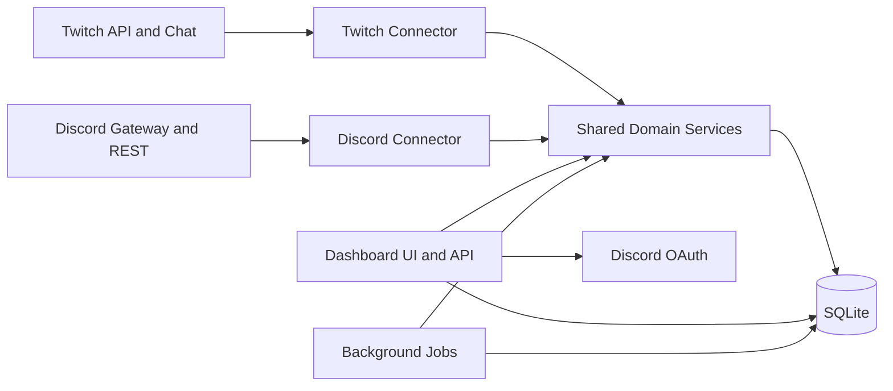
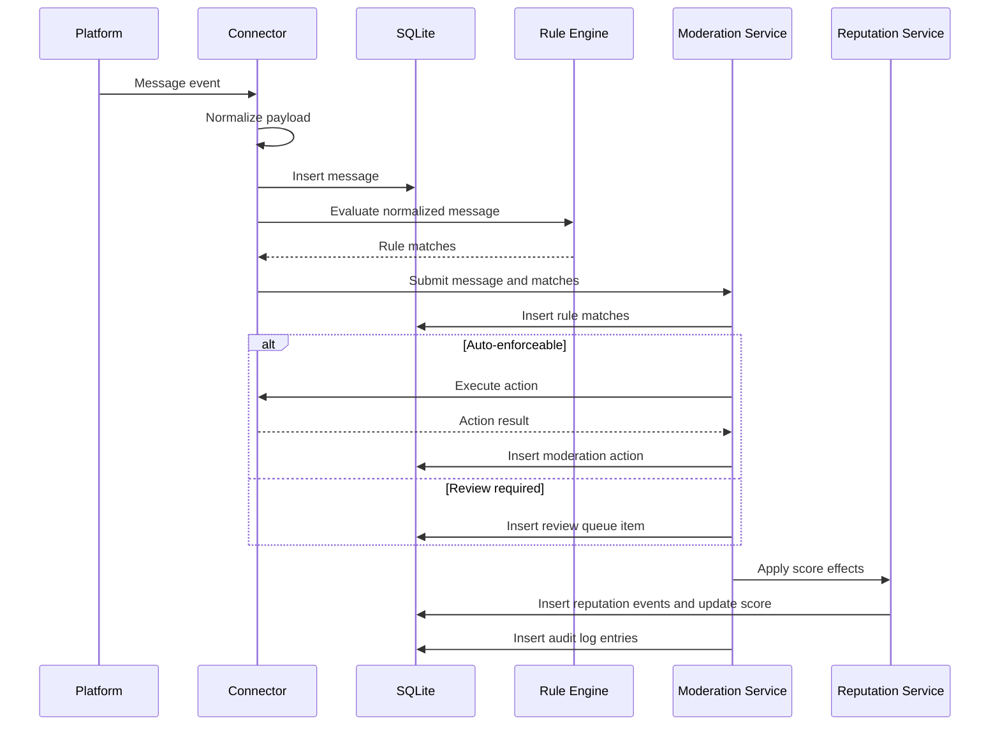

# QBot4K Architecture

## 1. Purpose
This document describes how QBot4K should be implemented to satisfy the requirements in the specification. It focuses on runtime structure, module boundaries, data ownership, control flow, and deployment decisions for the first production-capable release.

The target implementation is a Python application with:

- Twitch and Discord connectors.
- A shared moderation and reputation domain layer.
- A server-rendered dashboard.
- SQLite as the system of record.
- Discord OAuth for dashboard operator authentication.

## 2. Architectural Goals
The architecture should optimize for:

- Clear separation between platform-specific code and shared business logic.
- A simple deployment model that can run locally as one process.
- Incremental evolution toward multiple worker processes if load requires it.
- Durable event capture before expensive processing.
- Auditable moderation and operator actions.
- Minimal framework lock-in around storage and HTTP surfaces.

## 3. Runtime Topology
The first release should ship as one Python application that can start four logical subsystems:

- Dashboard web server.
- Twitch connector worker.
- Discord connector worker.
- Background job runner.

For local development, these may run in one process under a shared application container. For production, they should be able to run as separate entrypoints while using the same configuration and database.

## 4. Repository Structure
The current repository layout should evolve toward the following responsibility map:

- src/__main__.py
	Application bootstrap, config validation, dependency wiring, and startup orchestration.
- src/twitch.py
	Twitch connector runtime, message ingestion, and outbound moderation actions.
- src/discord.py
	Discord connector runtime, message ingestion, outbound moderation actions, and OAuth helpers if shared auth code is kept nearby.
- src/intelligence/userprofiles.py
	Canonical user resolution, account linking, profile queries, and user summary construction.
- src/intelligence/powerusers.py
	Reputation event application, score computation, candidate promotion thresholds, and score explanation logic.
- src/dashboard/overview.py
	Overview queries, health aggregation, and server-rendered page plus API responses.
- src/dashboard/users.py
	User search, filters, detail views, notes, and manual linking or unlinking actions.
- src/dashboard/moderation.py
	Review queue, recent actions, enforcement forms, and moderation action handlers.

The project will likely need additional modules even though they do not exist yet:

- src/config.py
	Typed settings and environment parsing.
- src/db.py
	Database connection management, schema migration bootstrap, and transaction helpers.
- src/models.py or src/schema.py
	Shared persistence and domain data structures.
- src/rules.py
	Moderation rule compilation and evaluation.
- src/moderation.py
	Shared moderation orchestration and audit recording.
- src/auth.py
	Discord OAuth login, session management, and role resolution.
- src/jobs.py
	Scheduled tasks and rollups.
- src/templates/
	Server-rendered dashboard templates.
- src/static/
	CSS and small JavaScript enhancements.

## 5. Core Design Principles
### 5.1 Normalize Early
Platform-specific events should be converted into a common message event shape immediately after receipt. All downstream systems should operate on the common shape rather than platform-native payloads.

### 5.2 Persist Before Enrichment
Inbound messages and moderation-relevant events should be written to SQLite before rule evaluation side effects or background enrichment. This reduces data loss risk during connector or process failures.

### 5.3 Shared Domain Services
Moderation, reputation, account linking, and audit behavior must live in shared services rather than inside connector modules or dashboard handlers.

### 5.4 Explicit Actor Attribution
Every mutation must identify an actor type:

- system
- moderator
- admin
- connector

This keeps moderation, linking, and settings changes traceable.

## 6. Logical Components
### 6.1 Config Layer
Responsibilities:

- Load environment variables.
- Parse lists such as Twitch channels and allowed Discord guild IDs.
- Validate required secrets, OAuth settings, and database path.
- Expose typed settings to all subsystems.

Failure mode:

- The application must fail at startup if required configuration is absent or malformed.

### 6.2 Database Layer
Responsibilities:

- Open and manage SQLite connections.
- Apply schema migrations at startup or through a dedicated admin command.
- Provide transaction wrappers for moderation and linking workflows.
- Encapsulate SQL queries or back them with a lightweight data access layer.

SQLite constraints and mitigations:

- Use WAL mode to improve concurrent read and write behavior.
- Keep write transactions short.
- Precompute expensive aggregates for dashboard charts.
- Avoid long-running locks inside connector message handlers.

### 6.3 Connector Layer
Connector responsibilities:

- Receive platform events.
- Normalize event payloads.
- Persist events.
- Request shared rule evaluation.
- Execute outbound moderation actions delegated by the shared moderation service.
- Report connector health.

Connector boundaries:

- Connectors may understand platform permission models and API quirks.
- Connectors must not contain platform-independent moderation policy.

### 6.4 Rule Engine
Responsibilities:

- Load active rules from configuration or storage.
- Evaluate normalized messages against compiled matchers.
- Produce deterministic match results with severity, reason codes, and recommended actions.
- Mark whether a result is auto-enforceable.

Design choice:

- The first version should use deterministic rules only.
- Rules should be pure where practical so unit testing is straightforward.

### 6.5 Moderation Service
Responsibilities:

- Accept message events and rule matches.
- Decide whether to auto-enforce or queue for review.
- Issue outbound actions through connector-specific adapters.
- Persist moderation actions, review items, and audit records.
- Support operator-initiated actions from the dashboard.

Design choice:

- The moderation service is the only layer allowed to create moderation_actions and review_queue records.

### 6.6 User Profile Service
Responsibilities:

- Resolve canonical user records from platform accounts.
- Create users on first meaningful activity when no linked user exists.
- Link or unlink platform accounts through explicit operator workflows.
- Return profile views composed from multiple tables.

Design choice:

- Historical events keep the original platform account references even after unlinking.

### 6.7 Reputation Service
Responsibilities:

- Convert moderation and participation events into score deltas.
- Persist reputation_events.
- Update cached current score fields on users.
- Compute candidate flags based on configurable thresholds.

Design choice:

- Score changes should be event-sourced enough to recompute from history if formulas change.

### 6.8 Dashboard Layer
Responsibilities:

- Render HTML pages for overview, users, and moderation.
- Expose JSON endpoints for asynchronous UI fragments where needed.
- Enforce auth and authorization.
- Translate forms into shared domain service calls.

Design choice:

- Keep business logic out of page handlers.
- Template views should depend on query services that are independently testable.

### 6.9 Auth Layer
Responsibilities:

- Redirect operators to Discord OAuth.
- Handle callback validation.
- Look up or create a local operator identity based on Discord account.
- Create and revoke application sessions.
- Resolve moderator versus admin roles from local storage.

Design choice:

- Authorization remains local even though authentication is delegated to Discord OAuth.

### 6.10 Job Runner
Responsibilities:

- Recompute metrics rollups.
- Reconcile reputation summaries if needed.
- Expire old data according to retention settings.
- Check backup execution or backup freshness.
- Run connector health probes or staleness checks.

## 7. Primary Flows
### 7.1 Message Ingestion Flow

### 7.2 Manual Account Linking Flow
1. Operator opens a user or account detail page.
2. Operator selects a second platform account to link.
3. Dashboard submits the request to the user profile service.
4. Service validates operator permissions and checks for conflicting links.
5. Service writes the link inside a transaction.
6. Service records an audit entry with operator identity.
7. UI reloads the merged profile state.

### 7.3 Operator Moderation Flow
1. Operator reviews a queued item or user profile.
2. Operator chooses an action and provides an optional reason.
3. Dashboard sends the request to the moderation service.
4. Moderation service validates authorization and connector capability.
5. Connector executes the action on the target platform.
6. The result is persisted as a moderation action and audit entry.
7. Reputation effects are applied if configured.

## 8. Data Ownership and Boundaries
### 8.1 Connector-Owned Concerns
- Platform authentication.
- Event transport and reconnect behavior.
- API rate limiting and permission handling.
- Platform-specific moderation command translation.

### 8.2 Shared Domain-Owned Concerns
- Rule evaluation semantics.
- Review queue creation.
- Reputation rules.
- Canonical user identity.
- Audit logging.

### 8.3 Dashboard-Owned Concerns
- Session cookies.
- Page rendering.
- Filter parsing and pagination.
- Operator forms and validation feedback.

## 9. Data Model Notes
The specification defines the minimum tables. This section adds implementation detail.

### 9.1 Suggested Table Shapes
- users
	id, primary_display_name, current_reputation_score, candidate_flag, created_at, updated_at
- platform_accounts
	id, platform, platform_user_id, username, guild_or_channel_context, user_id nullable, created_at, updated_at
- messages
	id, platform, platform_message_id, platform_account_id, channel_id, content_raw, content_normalized, sent_at, created_at
- moderation_rules
	id, name, rule_type, pattern, severity, auto_enforce_action nullable, enabled, created_at, updated_at
- rule_matches
	id, message_id, moderation_rule_id, severity, reason_code, confidence, recommended_action, created_at
- moderation_actions
	id, platform, message_id nullable, target_platform_account_id, action_type, actor_type, actor_id nullable, reason, status, created_at
- reputation_events
	id, user_id, source_type, source_id, delta, reason_code, created_at
- user_notes
	id, user_id, operator_id, body, created_at
- review_queue
	id, message_id, status, severity, queue_reason_code, assigned_operator_id nullable, created_at, resolved_at nullable
- audit_log
	id, actor_type, actor_id nullable, action_type, entity_type, entity_id, payload_json, created_at
- metrics_rollups
	id, metric_name, bucket_start, bucket_size, dimension_json, value, created_at

### 9.2 Query Strategy
- Overview charts should query metrics_rollups first.
- User detail pages should read raw history directly with pagination.
- Review queue filters should index status, severity, platform, and created_at.
- Messages should index sent_at and platform_account_id.

## 10. API and UI Design
The dashboard is server-rendered, but JSON endpoints still matter for filtering, search, and asynchronous updates.

Suggested split:

- HTML routes
	/login, /overview, /users, /users/{id}, /moderation
- JSON routes
	/api/overview, /api/users, /api/users/{id}, /api/moderation/actions, /api/moderation/reviews, /api/health
- Form POST routes
	/users/link, /users/{id}/notes, /moderation/actions, /moderation/reviews/{id}/resolve

The HTML handlers should reuse the same query services as JSON endpoints.

## 11. Security Design
### 11.1 Session Model
- Use secure, HTTP-only session cookies.
- Bind sessions to server-side session storage or signed cookies with revocation support.
- Enforce CSRF protection for mutating dashboard routes.

### 11.2 Authorization Model
- moderator
	Can view data, create notes, resolve review items, and issue standard moderation actions.
- admin
	Includes moderator permissions plus unlinking, rule changes, retention changes, and operator administration.

### 11.3 Audit Requirements
- Log successful and failed high-impact actions.
- Log login and logout events.
- Log link and unlink requests, including validation failures caused by conflicts.

## 12. Reliability Design
### 12.1 Failure Isolation
- A connector crash should not take down the dashboard if processes are separated.
- In single-process mode, connector failures should be caught and restarted where feasible.

### 12.2 Idempotency
- Use platform message IDs to avoid duplicate message persistence where available.
- Moderation retries must not create duplicate action rows without a retry marker or idempotency strategy.
- Rollup jobs should replace or upsert deterministic aggregate buckets.

### 12.3 Backups
- Copy SQLite database and WAL safely using an application-aware backup routine.
- Store backup metadata so the job runner can report freshness.

## 13. Suggested Technology Choices
These choices fit the current spec but can still be swapped if implementation starts immediately:

- Web framework: FastAPI or Flask with Jinja templates.
- ORM or data access: SQLAlchemy Core or SQLModel-level abstractions kept thin.
- Discord integration: discord.py for bot connectivity plus OAuth HTTP flow handling.
- Twitch integration: TwitchIO or a similarly maintained Python library.
- Background scheduling: APScheduler or a lightweight internal scheduler.

Selection criteria:

- Good SQLite support.
- Straightforward sync or async integration with connectors.
- Minimal hidden behavior around transactions.

## 14. Deployment Shape
Recommended production layout:

- Reverse proxy handling TLS and routing.
- Python application service.
- Persistent storage mounted for SQLite and backups.
- Optional separate process definitions for web, connectors, and jobs.

Configuration should be environment-driven so local development, staging, and production share the same code path.

## 15. Testing Strategy
### 15.1 Unit Tests
- Rule matching.
- Reputation scoring.
- Link conflict validation.
- Authorization checks.

### 15.2 Integration Tests
- Message persistence and rule-triggered review creation.
- Manual link and unlink workflows.
- Dashboard auth callback and session establishment.
- Operator moderation actions and audit logging.

### 15.3 Smoke Tests
- App startup with valid config.
- Startup failure with missing secrets.
- Connector connection bootstrap in a mocked environment.

## 16. Known Open Design Decisions
- The exact Python web framework is not yet fixed.
- Whether storage access should be mostly raw SQL, SQLAlchemy Core, or a small repository layer is still open.
- The exact threshold formulas for positive contribution and candidate promotion need product approval.
- Per-platform auto-enforcement rules still need final policy sign-off.
